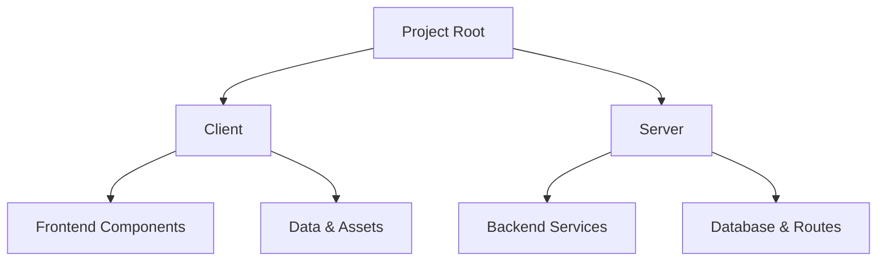

# Project Portfolio Website

A full-stack web portfolio designed to showcase projects with interactive elements, built with React and Node.js.

## Link to portfolio
Note that the web may take some times to load due to render automatically shutting the web down when not in use
https://personal-portfolio-b798.onrender.com

## Features
- Responsive project gallery with image pop-ups.
- Contact form for user inquiries.
- Navigation bar for easy access to sections.
- Dynamic content loading based on project data.

## Project Structure

The project is organized into two main directories:

### Client
- Frontend code using React and Vite.
  - `client/src/components/`: Reusable UI components (e.g., Navbar, ProjectCard).
  - `client/src/data/`: Project data and custom hooks.
  - `client/src/images/`: Project-related images.
  - `client/src/pages/`: Page components (e.g., HomePage).
  - `client/src/styles/`: Global and module CSS files.

### Server
- Backend logic using Node.js and Express.js.
  - `server/config/`: Database and server configurations.
  - `server/controllers/`: Handle request logic (e.g., contactController).
  - `server/models/`: Database schemas (e.g., Contact).
  - `server/routes/`: API endpoints.
  - `server/.env`: Environment variables.
  - `server/database.sql`: SQL database schema.
  - `server/server.js`: Main backend entry point.

Here's a Mermaid diagram illustrating the project structure:

## Tech Stack

### Frontend
- **Language**: JavaScript (ES6+)
- **Framework**: React
- **Build Tool**: Vite
- **Styling**: CSS Modules, Global CSS
- **Other Dependencies**: Custom hooks for interactivity (e.g., mouse tracking, smooth scrolling).

### Backend
- **Language**: JavaScript (Node.js)
- **Web Framework**: Express.js
- **Database**: SQL (from database.sql and config/database.js)
- **Utilities**: catchAsync.js for error handling.

## Contributing and License
- Contributing guidelines would be added here if available.
- License: [To be specified, e.g., MIT License]